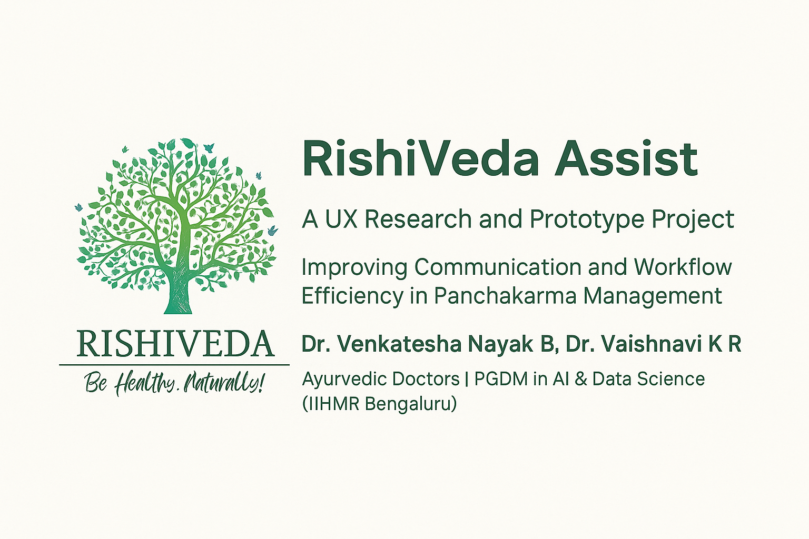

<!-- Banner -->

  

# 🌿 RishiVeda Assist

**RishiVeda Assist** is a UX research and design project focused on improving communication and workflow efficiency in Ayurvedic Panchakarma management.

This initiative was inspired by real-world challenges faced by Ayurvedic doctors and therapists in managing treatment scheduling, documentation, and communication.  
The goal is to create digital solutions that simplify these processes while preserving the essence of Ayurvedic practice.

---

## 📂 Contents

- `Doctor Portal.png` — Low-fidelity wireframe for doctor’s interface  
- `Home Screen.png` — App entry and login mockup  
- `RishiVeda_Assist_User_Research_and_Low_Fidelity_Design.pdf` — Complete user research summary and design flow document  

---

## 🔍 Design Previews

  <h4>Doctor Portal</h4>
  

  <h4>Home Screen</h4>
  

  

    <a href="designs/RishiVeda_Assist_User_Research_and_Low_Fidelity_Design.pdf">📄 View Full PDF Report</a>
  

---

## 💡 Purpose

This repository documents the early design phase of *RishiVeda Assist*.  
It includes manual low-fidelity prototypes created in Figma, representing user journeys and interface ideas before high-fidelity development.

Future updates may include:
- Interactive prototypes  
- Information architecture refinements  
- Integration concepts for Ayurvedic hospital workflows  

---

## 🧠 Authors

**Dr. Venkatesha Nayak B**  
Ayurvedic Doctor · PGDM in AI & Data Science in Healthcare  

**Dr. Vaishnavi K R**  
Ayurvedic Doctor · PGDM in AI & Data Science in Healthcare  

---

## 🪶 Notes

These designs represent conceptual explorations made during the UX research stage.  
They are part of a broader initiative to reimagine Ayurvedic clinical workflows using thoughtful, technology-assisted systems.

---

## 🛠️ Roadmap

- [ ] Add interactive prototype in Figma  
- [ ] Create patient and therapist interfaces  
- [ ] Conduct usability testing with Ayurvedic doctors  
- [ ] Explore integration with hospital EMR systems  
- [ ] Prepare for open beta of RishiVeda Assist
